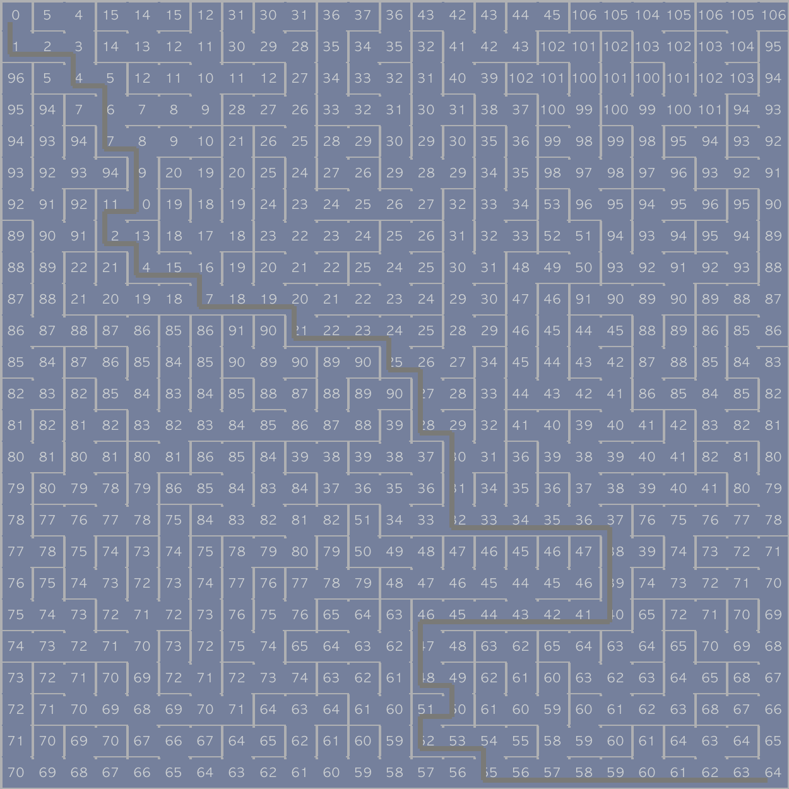
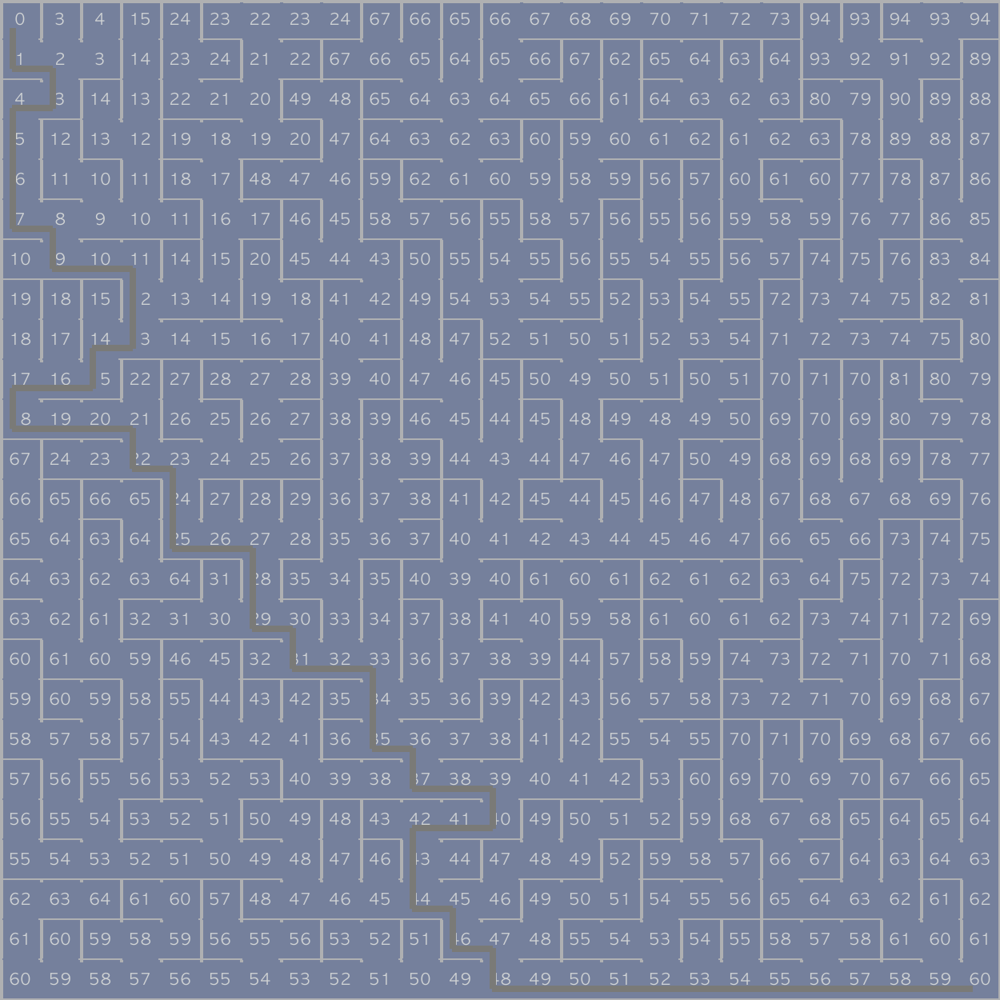
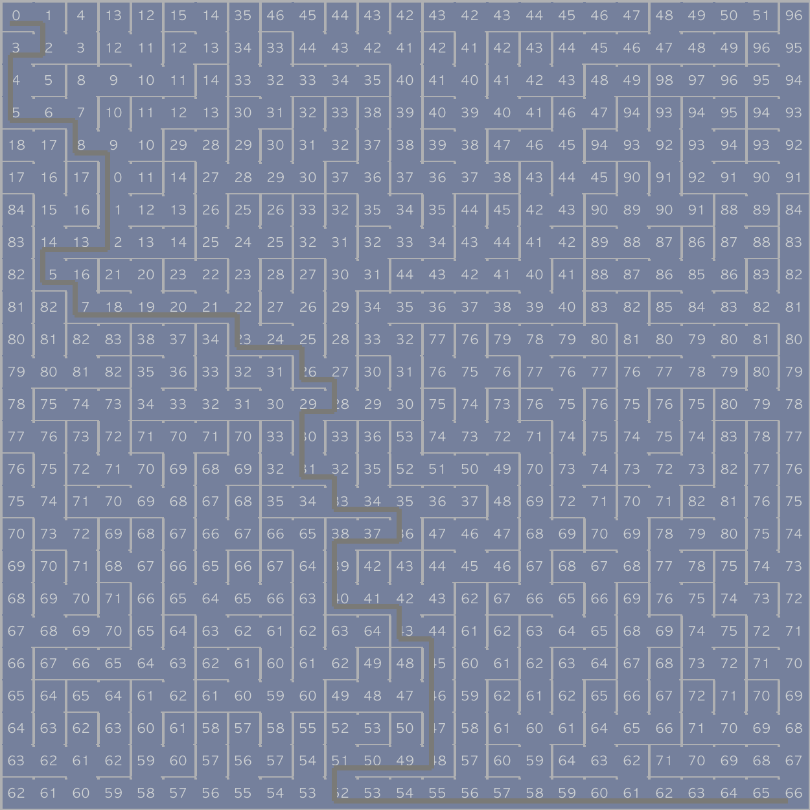
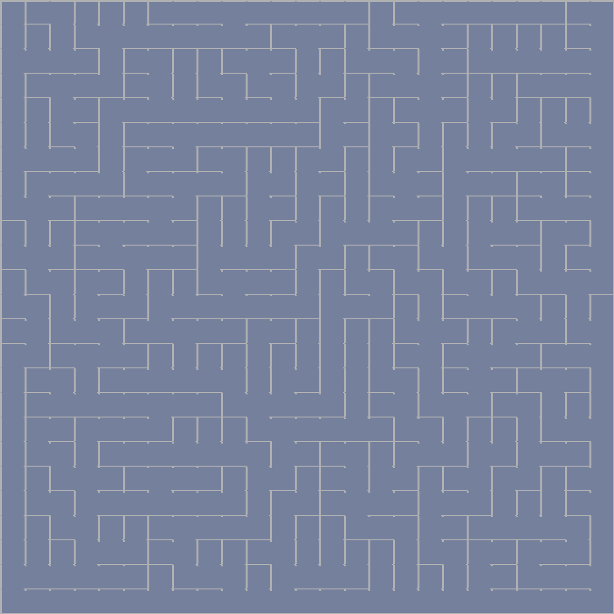

# Maze Generating and Solving

## Produced Results:
Some interesting result with the maze generating and solving algorithm:






## Objectives
* The purpose of this algorithm is to generate a maze and find a path solve it.
  * Generating the maze utilizes the Sidewinder Maze Algorithm.
    * The maze is implemented using the graph ADT.
  * Solving the maze utilizes the Dijkstra's Algorithm.

## Maze implementation
To begin with, we can think of a maze as a grid consisting of grid cells.
We can start by initializing with a spare maze where only
grid cells exist. As the below example:

### `Cell`
Grid cells are referred to as a `Cell` class and has the
attributes of keeping track of the location (row/col coordinates)
of the cell, the neighbor cells (north/south/east/west), and which neighbors
are "linked" (e.g. a passage) as opposed to a wall in between.

### `Grid`
Since we can think of a maze as a grid consisting of grid cells, 
the `Grid`class has the default initialization of populating all the cells.
After populating all the cells, we can iterate through the cells telling them whom
their neighbors are (e.g. for the most northwest starting cell, it would have neighbors
of to the south and east). 

`Grid` has the print() method for printing out the grid for evaluation. 
Here is a simple output of an empty grid, which should look like the spare maze shown above.
```
+---+---+---+---+
|   |   |   |   |
+---+---+---+---+
|   |   |   |   |
+---+---+---+---+
|   |   |   |   |
+---+---+---+---+
```
And a grid that has been made into a maze from the empty grid:
```
+---+---+---+---+
|               |
+   +---+   +   +
|   |       |   |
+---+---+---+   +
|               |
+---+---+---+---+
```
In order to generate an image of the above created maze, the `Grid` class
should consist of a export method and can generator created maze as the image below:


### `SidewinderMazeMaker`
The `SidewinderMazeMaker` class creates a maze using the generated `Grid`
with the Sidewinder Maze algorithm. The algorithm works by maintaining 
a set of cells forming the current run, and it connects each cell to the run
with a rightward passage; thus, it generates maze with passages
tend to have horizontally straight sections creating a winding pattern.

### `DijkstraSolver`
Uses Dijkstra's algorithm to find a solution to the maze and returns the path
with cells connecting to the target.

* Initialize source: 
  * Set the distance attribute of all nodes (cells) in the graph (grid) to `float('inf')`
  * Set the distance for the source node (the north-west cell) to be 0
* Put all the nodes in the graph into a queue
* While there are more nodes in the queue: 
  * Get the node from the queue with the smallest distance assigned
  * Add it to the set of nodes that we know the distance to
  * For all the linked neighbors of the node, `relax` the weights 
* Recover the path from the grid: 
  * Start with the target cell (the cell at the south-east corner of the maze)
  * Put it in the path 
  * Until we get to the source: 
    * Find the linked neighbor that has the smallest distance
    * Put it in the path 
  * Reverse the path list
  * Return the path

